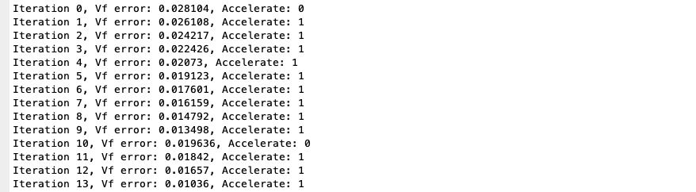
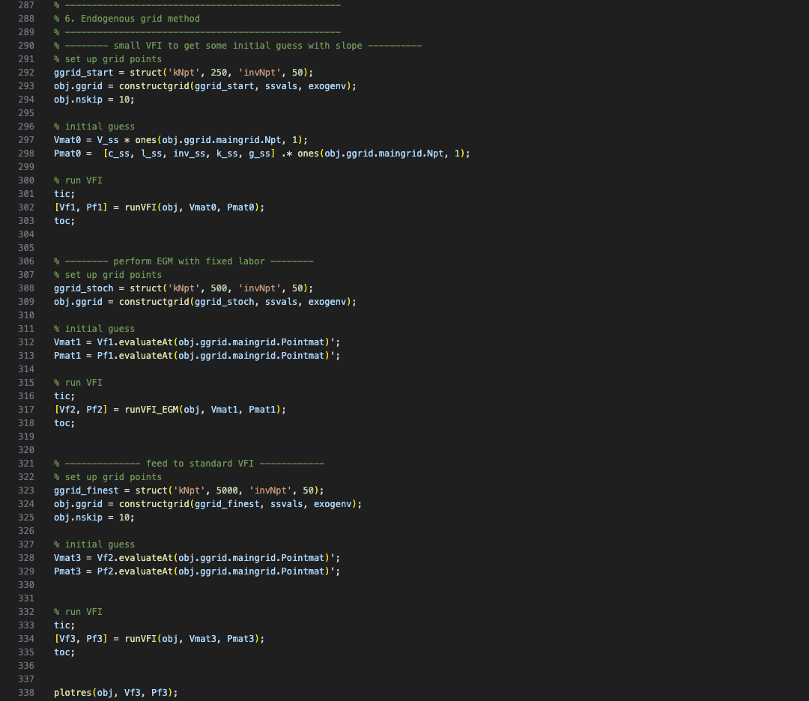

# Homework I, ECON 8210, Fall 2024
Author: Jiacheng Li  
Created: Oct. 19  
Updated: Oct. 29

## 1. Github
Please see the link: https://github.com/realjiachengli/ECON_8210_repository

## 2. Integration
The goal is to compute the integral: 
$$\int_0^T e^{-\rho t} u\left(1-e^{-\lambda t}\right) d t$$
with $T=100,\rho = 0.04, \lambda = 0.02, u(c) = - e^c$ using the following methods: 
- Midpoint quadrature
- Trapezoid quadrature
- Simpson rule
- Monte Carlo method

I implement each of the methods in Matlab and report the codes and results below. For Trapezoid and Simpson rule quadratures, I used the `compecon` toolbox of Miranda and Fackler (2002). 

### Codes

The midpoint method is implemented by the simple function:   

### Results: 

The Monte Carlo integration uses 5000 random draws from the uniform. It is clear that this is the least accurate, while Midpoint Rule is the second to last worst performed. With sufficiently high number of nodes, the quadrature methods yield good performance for this simple problem.

## 3. Optimization: basic problem
This exercise involves minimizing the classic Rosenbrock function:
$$ \min _{x, y} 100\left(y-x^2\right)^2+(1-x)^2$$
using various direction-based methods, including: 
- Newton-Raphson,
- BFGS (quasi-Newton),
- steepest descent, 
- conjugate descent method (I used the momentum update method, where the update rule of direction follows: $v^{(k+1)}=\beta v^{(k)}-\alpha g^{(k)}$.)

In the codes, I nest these methods in a single function:   

For BFGS, I use the built-in Matlab function `fminunc`, which implements BFGS as its default algorithm for quasi-Newton method. 

The analytical gradient and Hessian are provided for steepest descent and Newton-Raphson.   

Below are the implementations:   

### Results: 
1. **BFGS**: as expected, BFGS performs pretty well even though it does not directly require analytical Hessian. It reaches the minimum $(1,1)$ in only 20 iterations.  

2. **Steepest descent**: no surprise that it performs quite slow. After 10000 iterations, it is close to but still hasn't reached the minimum (I set $\alpha = 0.01$ rather than searching for the optimal step size):   

3. **Newton-Raphson**: this works the fastest, converging to the true minimum within 6 iterations.  

4. **Conjugate descent method** (momentum $\beta = 0.5, \alpha = 0.01$): there is some improvement relative to the steepest descent but not too much. Some distance remains after 10000 iterations, although it performs better than steepest descent.   

## 4. Computing Pareto efficient allocatioins

Given endowment $e^{i}_j, i = 1, ..., m$ and $j = 1, ..., n$, the social planner solves 
$$
\begin{align*}
\max_{\left\{ x_{j}^{i}\right\} _{\forall i,\forall j}}\;&\sum_{i=1}^{n}\lambda_{i}\sum_{j=1}^{m}\alpha_{j}\frac{(x_{j}^{i})^{1+\omega_{j}^{i}}}{1+\omega_{j}^{i}}\\\text{s.t. }&\sum_{i=1}^{n}x_{j}^{i}=\sum_{i=1}^{n}e_{j}^{i}\equiv\bar{e}_{j}\quad\forall j=1,...,m
\end{align*}
$$

I solve this problem directly as an optimization problem in Matlab, using `fmincon`. In particular, notice that the individual-good specific nature of the problem allows us to **easily compute the gradient of the objective function analytically**. Notice that 
$$ f^{\prime}{}_{i,j}=\lambda_{i}\alpha_{j}\frac{(x_{j}^{i})^{\omega_{j}^{i}}}{\omega_{j}^{i}}$$

Thus, we can directly compute and feed the gradient at each evaluation to `fmincon`, which greatly accelerate the computation.

### Codes
The objective function is evaluated in the following function:   

This following function takes a given set of physical parameters as input and report the optimal allocation:  

I compute the optimal allocation in the two examples:   

### Results
Even with $n=m=10$ and a significant amount of heterogeneity (I assign random weights and elasticities to agents), the social planner's problem can be solved very fast (less than 1 sec). Here are the resulting allocations:   

## 5. Computing Equilibrium allocations
Now, we move on to compute the decentralized competitive equilibrium allocations in the same economy.

The individual decision problem gives the Lagrangian: 
$$\mathcal{L}^{i}=\sum_{j=1}^{m}\alpha_{j}\frac{(x_{j}^{i})^{1+\omega_{j}^{i}}}{1+\omega_{j}^{i}}+\lambda^{i}\left[\sum_{j=1}^{n}p_{j}e_{j}^{i}-\sum_{j=1}^{n}p_{j}x_{j}^{i}\right]$$

We can set the numeriare: $p_{1}=1$ and get the first-order conditions: 
$$ \alpha_{j}(x_{j}^{i})^{\omega_{j}^{i}}=\lambda^{i}p_{j}\implies x_{j}^{i}=\left(\frac{\lambda^{i}p_{j}}{\alpha_{j}}\right)^{\frac{1}{\omega_{j}^{i}}}$$
where we substitute out consumptions to get a demand curve for each good $j$ for each agent $i$.

The competitive equilibrium is characterized by
- $m$ market clearing conditions: $$\sum_{i=1}^{n}\left(\frac{\lambda^{i}p_{j}}{\alpha_{j}}\right)^{\frac{1}{\omega_{j}^{i}}}=\sum_{i=1}^{n}e_{j}^{i}\quad\forall j=1,...,m$$
- $n-1$ budget constraint (the last one will be redundant): $$\sum_{i=1}^{n}p_{j}e_{j}^{i}=\sum_{i=1}^{n}p_{j}x_{j}^{i},\;\forall i=2,...,n$$
in $m-1$ prices and $n$ Lagrangian multipliers ($n + m - 1$ variables in total). 

Next, we code this non-linear system of equations into Matlab.  

And similarly, we pack the solver into a function:  

Let us solve the simple problem as in SP to see the results:   

Since the total endowment of the first and third goods are the same, and the agents assign the same weights and elasticities. They have the same prices in CE.

## 6. Value Function Iteration

### 6.1 Social planner

The original representative agent problem can be recast into the following social planner's problem with recursive formulation: 
$$
\begin{align*}
    V\left(k,{\color{red}i};\tau,z\right)&=\max_{c,l,{\color{red}i'}}\;\log c+0.2\log{\color{orange}g}-\frac{l^{2}}{2}+0.97\mathbb{E}_{\tau',z'\vert\tau,z}\left[V\left(k',{\color{red}i'};\tau',z'\right)\right]\\\text{s.t. }&c+i'=(1-\tau)(1-\alpha)e^{z}k^{\alpha}l^{1-\alpha}+\alpha e^{z}k^{\alpha}l^{1-\alpha}\\&k'=0.9k+\left(1-0.05\left({\color{red}\frac{i'}{i}}-1\right)^{2}\right)i'
\end{align*}
$$

There are two things worth noting: 
- One need an additional state variable $i$, which represents that last-period investment, to make the problem recursive.
- There is a question as to **whether one should endogenize the government balanced budget** $g = \tau w l$ into the decision problem. 
  1. Because the question asks for solving the social planner's problem, I'm tempted to say yes. In that case, one just replaces the $g$ in the value function with $\tau w l$, and agents will take it into account in their FOCs.
  2. If no, one solves the Bellan equation as if it is without this term $\log g$, since it does not induce any changes to decisions. Then, with the solved policy $l^{\star}$ at each grid point, we substitute in $g=\tau e^z(1-\alpha) k^{\alpha} (l^{\star})^{1-\alpha}$ to the value function.

I will solve the problem **assuming the second case**, because it is more natural and consistent with a market equilibrium. 
Define for convenience the wedge on output: $\psi\equiv(1-\tau)(1-\alpha)+\alpha$.
As a result, the problem becomes: 
$$
\begin{align*}
    V\left(k,{\color{red}i};\tau,z\right)&=\max_{c,l,{\color{red}i'}}\;\log c+\eta\log\left(g\right)-\frac{l^{2}}{2}+\beta\mathbb{E}_{\tau',z'\vert\tau,z}\left[V\left(k',{\color{red}i'};\tau',z'\right)\right]\\\text{s.t. }&c+i'=\psi e^{z}k^{\alpha}l^{1-\alpha}\\&k'=\left(1-\delta\right)k+\left(1-\phi\left({\color{red}\frac{i'}{i}}-1\right)^{2}\right)i'
\end{align*}
$$
where $g = \tau(1-\alpha)e^{z}k^{\alpha}l^{1-\alpha}$, and I relabeled parameter values using parameter notations for generality. 

### 6.2 Steady state 
We can write the Lagrangian: 
$$
\begin{align*}
    \mathcal{L}=&\log c+\eta\log(g)-\frac{l^{2}}{2}+\beta\mathbb{E}_{\tau',z'\vert\tau,z}\left[V\left(k',{\color{red}i'};\tau',z'\right)\right]\\&+\lambda\left(\psi e^{z}k^{\alpha}l^{1-\alpha}-c-i'\right)
\end{align*}
$$
This gives the first-order conditions: 
$$
\begin{align*}
    \frac{1}{c}&=\lambda\\l&=\lambda\psi(1-\alpha)e^{z}k^{\alpha}l^{-\alpha}\\\beta\mathbb{E}_{\tau',z'\vert\tau,z}\left[V_{i}\left(k',{\color{red}i'};\tau',z'\right)+V_{k}\left(k',{\color{red}i'};\tau',z'\right)\frac{\partial k'}{\partial i'}\right]&=\lambda
\end{align*}
$$
where $$\frac{\partial k'}{\partial i'}=1-\phi\left({\color{red}\frac{i'}{i}}-1\right)^{2}+2\phi\frac{i'}{i}\left({\color{red}\frac{i'}{i}}-1\right)$$
And the envelop conditions: 
$$
\begin{align*}
    V_{i}\left(k,{\color{red}i};\tau,z\right)&=\beta\mathbb{E}_{\tau',z'\vert\tau,z}\left[V_{k}\left(k',{\color{red}i'};\tau',z'\right)\frac{\partial k'}{\partial i}\right]\\V_{k}\left(k,{\color{red}i};\tau,z\right)&=\lambda\psi\alpha e^{z}k^{\alpha-1}l^{1-\alpha}\\&+\beta(1-\delta)\mathbb{E}_{\tau',z'\vert\tau,z}\left[V_{k}\left(k',{\color{red}i'};\tau',z'\right)\right]
\end{align*}
$$
where $$\frac{\partial k'}{\partial i}=-2\phi\left({\color{red}\frac{i'}{i}}-1\right)\left(\frac{i'}{i}\right)^{2}$$

In the steady state, we have
$$V_{k}\left(\bar{k},\bar{i};\bar{\tau},\bar{z}\right)=\frac{1}{1-\beta(1-\delta)}\lambda\psi\alpha e^{z}\bar{k}^{\alpha-1}\bar{l}^{1-\alpha}$$ 

$$V_{i}\left(\bar{k},\bar{i};\bar{\tau},\bar{z}\right)=0$$

As a result, the steady state is characterized by the following equations: 
$$
\begin{align*}
    \frac{1}{\bar{c}}&=\bar{\lambda}\\\bar{l}&=\bar{\lambda}\psi(1-\alpha)e^{\bar{z}}\bar{k}^{\alpha}\bar{l}^{-\alpha}\\\psi\alpha e^{\bar{z}}\bar{k}^{\alpha-1}\bar{l}^{1-\alpha}&=1/\beta-1+\delta
\end{align*} 
$$

These implies that the steady state consists of three equations in three unknowns $(\bar{l},\bar{k},\bar{c})$:
$$
\begin{align*}
\bar{l}&=\frac{\psi(1-\alpha)e^{\bar{z}}\bar{k}^{\alpha}\bar{l}^{-\alpha}}{\bar{c}}\\1/\beta-1+\delta&=\psi\alpha e^{\bar{z}}\bar{k}^{\alpha-1}\bar{l}^{1-\alpha}\\\bar{c}+\delta\bar{k}&=\psi e^{\bar{z}}\bar{k}^{\alpha}\bar{l}^{1-\alpha}
\end{align*}
$$
and we can then get other variables: 
$$
\begin{align*}
\bar{y}&=e^{\bar{z}}\bar{k}^{\alpha}\bar{l}^{-\alpha}\\\bar{i}&=\delta\bar{k}\\\bar{g}&=\tau(1-\alpha)\bar{y}
\end{align*}
$$
Let us solve it in Matlab. 

##### Codes
The following function solve for the steady state as a system of non-linear equations:     

The steady state is computed and put into a structure for future use:    

Results:  

### 6.3 Value function iteration (fixed grid, multi-grid, stochastic grid, with policy acceleration)

**To organize this section in a cleaner way, I solve the recursive problem using the basic Value Function Iteration methods with exogenous grids first. I relegate the Endogenous Grid Method to the next section.**  

I proceed with the following steps:
1. solve the problem with **value function iteration with fixed grids** (250 gridpoints for capital, 50 gridpoints for lagged investment).
2. accelerate the method by **switching between policy and value function iteration**. In particular, only solve the maximization problem once in ten iterations, while simply fixing the policy (decision) in the rest.
3. **Multigrid**: solve the problem on a coarser grid (100 gridpoints for capital) first, then on a finer grid (500 gridpoints for capital) with the solution in the first round as the initial guess for value function, and finally on 5000 gridpoints for capital in the last round.
4. **Stochastic grid**: in the spirit of Rust (1997), in each round of the value function iteration, I draw an uniform random sample (of size 200) from the capital gridpoints (500 in total) at each iteration, solve the problem on those grid points, interpolate the value function, and iterate. I use a benchmark grid (the full grid) to evaluate convergence result (I re-interpolate the value function over the benchmark grid at the end of every iteration to compute the distance from the last round).

In all the methods except the first one, policy iteration acceleration (occasionally solving the optimal decision) steps are applied. In addition, I use parallelization in Matlab with 8 workers on my laptop to make my computation faster.

To solve the problem using Value Function Iteration, we can rescale the value function $\tilde{V} = (1-\beta) V$, and write the problem as: 
$$
\begin{align*}
    \tilde{V}\left(k,{\color{red}i};\tau,z\right)&=\max_{c,l}\;(1-\beta)\left[\log c+\eta\log\left(g\right)-\frac{l^{2}}{2}\right]+\beta\mathbb{E}_{\tau',z'\vert\tau,z}\left[\tilde{V}\left(k',{\color{red}i'};\tau',z'\right)\right]\\\text{s.t. }&i'=\psi e^{z}k^{\alpha}l^{1-\alpha}-c\\&k'=\left(1-\delta\right)k+\left(1-\phi({\color{red}\frac{i'}{i}}-1)^{2}\right)i'
\end{align*}
$$ 

To reduce the dimensionality of the decision problem (labor and investment), I use the following trick to reformulate the problem (making use of the static first-order condition for labor decision): notice that the labor decision is a static problem given the state variable, with FOC: $$l=(1-\alpha)\psi e^{z}k^{\alpha}l^{-\alpha}$$which implies optimal labor: $$l^{*}=\left((1-\alpha)\psi e^{z}k^{\alpha}\right)^{\frac{1}{1+\alpha}}$$

Thus, the problem becomes one that only involves a single choice variable: 
$$
\begin{align*}
    \tilde{V}\left(k,{\color{red}i};\tau,z\right)&=\max_{c}\;(1-\beta)\left[\log c+\eta\log\left(g\right)-\frac{l^{*2}}{2}\right]+\beta\mathbb{E}_{\tau',z'\vert\tau,z}\left[\tilde{V}\left(k',{\color{red}i'};\tau',z'\right)\right]\\\text{s.t. }&c=\psi e^{z}k^{\alpha}l^{*1-\alpha}-i'\\&k'=(1-\delta)k+\left(1-\phi\left({\color{red}\frac{i'}{i}}-1\right)^{2}\right)i'
\end{align*}
$$

#### Euler equation error

The Euler equation error can be defined by: $$err=1-\frac{\beta\mathbb{E}_{\tau',z'\vert\tau,z}\left[V_{i}\left(k',i';\tau',z'\right)+V_{k}\left(k',i';\tau',z'\right)\frac{\partial k'}{\partial i'}\right]}{(1-\beta)1/c}$$
where $\frac{\partial k'}{\partial i'}=1-\phi\left({\color{red}\frac{i'}{i}}-1\right)^{2}+2\phi\frac{i'}{i}\left({\color{red}\frac{i'}{i}}-1\right)$.

We can compute the derivative of the value function with respect to $i$ and $k$ using finite difference and the interpolated value function. Alternatively, we could use the Envelop condition to evaluate the value function derivatives more precisely.

##### Codes

The parameters characterizing the exogenous state transition, about the physical environment, the steady state values, and the grid objects are inputted and stored in `obj` structure:   

The basic VFI procedure is coded as follows:     
 

Each iteration updates V using the method we described:    

The objective function to maximize (the present value given consumption choice):   

Finally, to run all these, a specfic grid is constructed. The initial guess for the value function (and policy function, though this is not consequential) is the steady state value and choice variables. One more thing to notice is that I include five variables of interest in the policy function object and update them during the iterations. They don't matter for the computation, but helps me to recover these variables implied by optimal policy for each state in an easier way.   

The Euler equation errors are computed in the function:    

##### Results

The iterations look like below:   

Acceleration means acceleration steps by just iterating previous policy are applied. The `Vf error` is a bit misnamed - they are distance between two consecutive value function matrices.

For a fixed grid, here are the optimal value and policy functions:
](VFI_with_fixed_grid.png)

The Euler equation errors and running time are (4 parallel workers are used): 

We can see that this is very slow.

##### VFI with fixed grid with acceleration (switching between VFI and PFI)

This is simply setting `obj.nskip = 10` in my code.   

Results are the same, while convergence is much faster:   

##### VFI with multi-grid scheme

I implement the three rounds scheme as follows, where the last round uses 5000 grid points for capital.   

The final round only took 5 iterations to convergence:

The results:  
.png)

I plot the impulse response functions (IRFs) to a positive shock to tax and a positve shock to capital (while keeping them fixed at the mean values after the first shock period), given these optimal value and policy functions: 

The way how variables move mostly follow our intuition. 

##### VFI with stochastic grid

For the stochastic grid method, I uniformly draw a subsample (200) of capital grid points (combined with the entire investment and exogneous state grids) to solve and update the value function in each iteration. To make sure that we keep track of previous progress, the value function over unselected grid points are kept intact, while the rest are updated. After each iteration. The value function are re-interpolated and evaluated at a benchmark grid points to measure the convergence. 

The codes are adapted as follows:  

Here are the results:   

This is taking relatively long time compared to previous methods. And the value function errors remain quite large: 

### 6.4 Value function iteration with an endogenous grid

To solve the problem using the generalized Endogenous Grid method following Barillas and Fernandez-Villaverde (2006), we follow the two steps:
1. Solve the VFI while fixing $l = \bar{l}$ using the endogenous grid method.
2. Solve the original VFI from the solution of step 1 as an initial guess.

To reformulate the problem, we define a new state variable $$Y=\psi e^{z}k^{\alpha}\bar{l}^{1-\alpha}$$

The recasted problem is 
$$
\begin{align*}
    \tilde{V}\left(Y,{\color{red}i};\tau,z\right)&=\max_{i',l}\;(1-\beta)\left[\log\left(Y-i'\right)+\eta\log\left(g\right)-\frac{\bar{l}^{2}}{2}\right]+\beta\mathbb{E}_{\tau',z'\vert\tau,z}\left[\tilde{V}\left(Y',{\color{red}i'};\tau',z'\right)\right]\\\text{where }&Y'=\psi e^{z\prime}k'^{\alpha}\bar{l}^{1-\alpha}\\&k'=(1-\delta)k+\left(1-\phi\left({\color{red}\frac{i'}{i}}-1\right)^{2}\right)i'
\end{align*}
$$
where we used the inversion: $$Y=\psi e^{z}k^{\alpha}\bar{l}^{1-\alpha}\iff k=\left(\frac{Y}{\psi e^{z}}\right)^{1/\alpha}\bar{l}^{\frac{\alpha-1}{\alpha}}$$

Now, define $$\hat{V}(Y,{\color{red}i'},\tau,z)\equiv\mathbb{E}_{\tau',z'\vert\tau,z}\left[\tilde{V}\left(Y',i';\tau',z'\right)\right]$$
where the RHS can be evaluated knowing today's state and $i'$. 

We know the first-order condition: $$\frac{1}{Y-i'}=\frac{\beta}{1 - \beta}\frac{\partial\hat{V}(Y,i',\tau,z)}{\partial i'}$$

#### Algorithm of EGM

- To proceed, given a value function, on each grid point $(\tau,z,k,i)$: 
    1. For each $i'$, compute $k'$ and evaluate $\hat{V}(Y,{\color{red}i'},\tau,z)$;
    2. Approximate the derivate $\frac{\partial\hat{V}(Y,i';\tau,z)}{\partial i'}$ using a local finite difference method;;
    3. Compute corresponding $Y$ today, which also gives us $$k=\left(\frac{Y}{\psi e^{z}\bar{l}^{1-\alpha}}\right)^{\frac{1}{\alpha}}$$and thus we can evaluate $(1-\beta)\left[\log\left(Y-i'\right)+\eta\log\left(g\right)-\frac{\bar{l}^{2}}{2}\right]$. Finally, 
    $$
    \begin{align*}
    \tilde{V}(k,\hat{i};\hat{\tau},\hat{z})&=\tilde{V}\left(Y,\hat{i};\hat{\tau},\hat{z}\right)\\&=(1-\beta)\left[\log\left(Y-i'(k)\right)+\eta\log\left(g\right)-\frac{\bar{l}^{2}}{2}\right]\\&+\beta\hat{V}(Y,i'(k);\tau,z)
    \end{align*}
    $$
- Update the value function:
    1. Reinterpolate $\tilde{V}(k,\hat{i},\hat{\tau},\hat{z})$ over fixed $(\hat{i},\hat{\tau},\hat{z})$ and new endogenous grid points $k$. 
    2. Evaluate the interpolated value function over the base grids and update the relevant range of values over the fixed $(\hat{i},\hat{\tau},\hat{z})$. (Do the same for policy function as well). 

##### Codes
The outer implementation includes three main sections:
- Solving over a coarser grid to get a reasonable initial guess for value function,
- Perform the endogenous grid method with labor fixed at the steady state level,
- Now feed the policy function and value function back to standard VFI, which is expected to converge very fast.

Here are the run function and the updating procedure:

IN particular, a new function `Vhat` is defined that takes both today's state and actions as given, to compute the expected next period value. The finite difference method is applied to approximate the partial derivative with respect to `i'`, that is, (`(Vhat(i' + h)-Vhat(i'))/h`). Here is the `Vhat` function:

However, at some point, the implied endogneous grid start to jump out of the grid bound by too much, which eventually leads to negative consumption or capital and complex values. I'm still trying to make this code work. 

