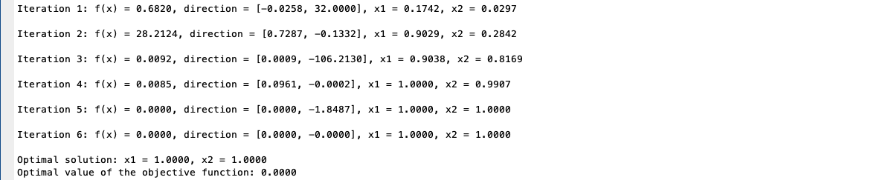

# Homework I, ECON 8210, Fall 2024
Author: Jiacheng Li  
Created: Oct. 19  
Updated: Oct. 20

## 1. Github
Please see the link: https://github.com/realjiachengli/ECON_8210_repository

## 2. Integration
The goal is to compute the integral: 
$$\int_0^T e^{-\rho t} u\left(1-e^{-\lambda t}\right) d t$$
with $T=100,\rho = 0.04, \lambda = 0.02, u(c) = - e^c$ using the following methods: 
- Midpoint quadrature
- Trapezoid quadrature
- Simpson rule
- Monte Carlo method

I implement each of the methods in Matlab and report the codes and results below. For Trapezoid and Simpson rule quadratures, I used the `compecon` toolbox of Miranda and Fackler (2002). 

### Codes

The midpoint method is implemented by the simple function:   

### Results: 

The Monte Carlo integration uses 5000 random draws from the uniform. It is clear that this is the least accurate, while Midpoint Rule is the second to last worst performed. With sufficiently high number of nodes, the quadrature methods yield good performance for this simple problem.

## 3. Optimization: basic problem
This exercise involves minimizing the classic Rosenbrock function:
$$ \min _{x, y} 100\left(y-x^2\right)^2+(1-x)^2$$
using various direction-based methods, including: 
- Newton-Raphson,
- BFGS (quasi-Newton),
- steepest descent, 
- conjugate descent method (I used the momentum update method, where the update rule of direction follows: $v^{(k+1)}=\beta v^{(k)}-\alpha g^{(k)}$.)

In the codes, I nest these methods in a single function:   

For BFGS, I use the built-in Matlab function `fminunc`, which implements BFGS as its default algorithm for quasi-Newton method. 

The analytical gradient and Hessian are provided for steepest descent and Newton-Raphson.   

Below are the implementations:   

### Results: 
1. **BFGS**: as expected, BFGS performs pretty well even though it does not directly require analytical Hessian. It reaches the minimum $(1,1)$ in only 20 iterations.  

2. **Steepest descent**: no surprise that it performs quite slow. After 10000 iterations, it is close to but still hasn't reached the minimum (I set $\alpha = 0.01$ rather than searching for the optimal step size):   

3. **Newton-Raphson**: this works the fastest, converging to the true minimum within 6 iterations.  

4. **Conjugate descent method** (momentum $\beta = 0.5, \alpha = 0.01$): there is some improvement relative to the steepest descent but not too much. Some distance remains after 10000 iterations, although it performs better than steepest descent.   

## 4. Computing Pareto efficient allocatioins

Given endowment $e^{i}_j, i = 1, ..., m$ and $j = 1, ..., n$, the social planner solves 
$$
\begin{align*}
\max_{\left\{ x_{j}^{i}\right\} _{\forall i,\forall j}}\;&\sum_{i=1}^{n}\lambda_{i}\sum_{j=1}^{m}\alpha_{j}\frac{(x_{j}^{i})^{1+\omega_{j}^{i}}}{1+\omega_{j}^{i}}\\\text{s.t. }&\sum_{i=1}^{n}x_{j}^{i}=\sum_{i=1}^{n}e_{j}^{i}\equiv\bar{e}_{j}\quad\forall j=1,...,m
\end{align*}
$$

I solve this problem directly as an optimization problem in Matlab, using `fmincon`. In particular, notice that the individual-good specific nature of the problem allows us to **easily compute the gradient of the objective function analytically**. Notice that 
$$ f^{\prime}{}_{i,j}=\lambda_{i}\alpha_{j}\frac{(x_{j}^{i})^{\omega_{j}^{i}}}{\omega_{j}^{i}}$$

Thus, we can directly compute and feed the gradient at each evaluation to `fmincon`, which greatly accelerate the computation.

### Codes
The objective function is evaluated in the following function:   

This following function takes a given set of physical parameters as input and report the optimal allocation:  

I compute the optimal allocation in the two examples:   

### Results
Even with $n=m=10$ and a significant amount of heterogeneity (I assign random weights and elasticities to agents), the social planner's problem can be solved very fast (less than 1 sec). Here are the resulting allocations:   

## 5. Computing Equilibrium allocations
Now, we move on to compute the decentralized competitive equilibrium allocations in the same economy.

The individual decision problem gives the Lagrangian: 
$$\mathcal{L}^{i}=\sum_{j=1}^{m}\alpha_{j}\frac{(x_{j}^{i})^{1+\omega_{j}^{i}}}{1+\omega_{j}^{i}}+\lambda^{i}\left[\sum_{j=1}^{n}p_{j}e_{j}^{i}-\sum_{j=1}^{n}p_{j}x_{j}^{i}\right]$$

We can set the numeriare: $p_{1}=1$ and get the first-order conditions: 
$$ \alpha_{j}(x_{j}^{i})^{\omega_{j}^{i}}=\lambda^{i}p_{j}\implies x_{j}^{i}=\left(\frac{\lambda^{i}p_{j}}{\alpha_{j}}\right)^{\frac{1}{\omega_{j}^{i}}}$$
where we substitute out consumptions to get a demand curve for each good $j$ for each agent $i$.

The competitive equilibrium is characterized by
- $m$ market clearing conditions: $$\sum_{i=1}^{n}\left(\frac{\lambda^{i}p_{j}}{\alpha_{j}}\right)^{\frac{1}{\omega_{j}^{i}}}=\sum_{i=1}^{n}e_{j}^{i}\quad\forall j=1,...,m$$
- $n-1$ budget constraint (the last one will be redundant): $$\sum_{i=1}^{n}p_{j}e_{j}^{i}=\sum_{i=1}^{n}p_{j}x_{j}^{i},\;\forall i=2,...,n$$
in $m-1$ prices and $n$ Lagrangian multipliers ($n + m - 1$ variables in total). 

Next, we code this non-linear system of equations into Matlab.  

And similarly, we pack the solver into a function:  

Let us solve the simple problem as in SP to see the results:   

Since the total endowment of the first and third goods are the same, and the agents assign the same weights and elasticities. They have the same prices in CE.

## 6. Value Function Iteration

### 6.1 Social planner

The original representative agent problem can be recast into the following social planner's problem with recursive formulation: 
$$
\begin{align*}
    V\left(k,{\color{red}i};\tau,z\right)&=\max_{c,l,{\color{red}i'}}\;\log c+0.2\log{\color{orange}g}-\frac{l^{2}}{2}+0.97\mathbb{E}_{\tau',z'\vert\tau,z}\left[V\left(k',{\color{red}i'};\tau',z'\right)\right]\\\text{s.t. }&c+i'=(1-\tau)(1-\alpha)e^{z}k^{\alpha}l^{1-\alpha}+\alpha e^{z}k^{\alpha}l^{1-\alpha}\\&k'=0.9k+\left(1-0.05\left({\color{red}\frac{i'}{i}}-1\right)^{2}\right)i'
\end{align*}
$$

There are two things worth noting: 
- One need an additional state variable $i$, which represents that last-period investment, to make the problem recursive.
- There is a question as to **whether one should endogenize the government balanced budget** $g = \tau w l$ into the decision problem. 
  1. Because the question asks for solving the social planner's problem, I'm tempted to say yes. In that case, one just replaces the $g$ in the value function with $\tau w l$, and agents will take it into account in their FOCs.
  2. If no, one solves the Bellan equation as if it is without this term $\log g$, since it does not induce any changes to decisions. Then, with the solved policy $l^{\star}$ at each grid point, we substitute in $g=\tau e^z(1-\alpha) k^{\alpha} (l^{\star})^{1-\alpha}$ to the value function.

Again, because the question goes after the **associated social planner's problem**, I will solve the problem in the first case. As a result, 
the problem becomes: 
$$
\begin{align*}
    V\left(k,{\color{red}i};\tau,z\right)&=\max_{c,l,{\color{red}i'}}\;\log c+\eta\log\left(\tau(1-\alpha)e^{z}k^{\alpha}l^{1-\alpha}\right)-\frac{l^{2}}{2}+\beta\mathbb{E}_{\tau',z'\vert\tau,z}\left[V\left(k',{\color{red}i'};\tau',z'\right)\right]\\\text{s.t. }&c+i'=\left[(1-\tau)(1-\alpha)+\alpha\right]e^{z}k^{\alpha}l^{1-\alpha}\\&k'=\delta k+\left(1-\phi\left({\color{red}\frac{i'}{i}}-1\right)^{2}\right)i'
\end{align*}
$$
where I relabeled parameter values using parameter notations for generality. 

### 6.2 Steady state 
We can write the Lagrangian: 
$$
\begin{align*}
    \mathcal{L}=&\log c+\eta\log\left(\tau(1-\alpha)e^{z}k^{\alpha}l^{1-\alpha}\right)-\frac{l^{2}}{2}+\beta\mathbb{E}_{\tau',z'\vert\tau,z}\left[V\left(k',{\color{red}i'};\tau',z'\right)\right]\\&+\lambda\left\{ \left[(1-\tau)(1-\alpha)+\alpha\right]e^{z}k^{\alpha}l^{1-\alpha}-c-i'\right\} 
\end{align*}
$$
This gives the first-order conditions: 
$$
\begin{align*}
    \frac{1}{c}&=\lambda\\{\color{orange}\eta(1-\alpha)\frac{1}{l}}&=l-\lambda\left[(1-\tau)(1-\alpha)+\alpha\right](1-\alpha)e^{z}k^{\alpha}l^{-\alpha}\\\beta\mathbb{E}_{\tau',z'\vert\tau,z}\left[V_{i}^{\prime}\left(k',{\color{red}i'};\tau',z'\right)+V_{k}^{\prime}\left(k',{\color{red}i'};\tau',z'\right)\frac{\partial k'}{\partial i'}\right]&=\lambda
\end{align*}
$$
where $$\frac{\partial k'}{\partial i'}=1-\phi\left({\color{red}\frac{i'}{i}}-1\right)^{2}+2\phi\frac{i'}{i}\left({\color{red}\frac{i'}{i}}-1\right)$$
And the envelop conditions: 
$$
\begin{align*}
    V_{i}^{\prime}\left(k',{\color{red}i'};\tau',z'\right)&=\beta\mathbb{E}_{\tau',z'\vert\tau,z}\left[V_{k}^{\prime}\left(k',{\color{red}i'};\tau',z'\right)\frac{\partial k'}{\partial i}\right]\\V_{k}^{\prime}\left(k',{\color{red}i'};\tau',z'\right)&=\eta\alpha\frac{1}{k}+\lambda\left[(1-\tau)(1-\alpha)+\alpha\right]\alpha e^{z}k^{\alpha-1}l^{1-\alpha}\\&+\beta\mathbb{E}_{\tau',z'\vert\tau,z}\left[V_{k}^{\prime}\left(k',{\color{red}i'};\tau',z'\right)\right]\cdot\delta
\end{align*}
$$
where $$\frac{\partial k'}{\partial i}=-2\phi\left({\color{red}\frac{i'}{i}}-1\right)\left(\frac{i'}{i}\right)^{2}$$

In the steady state, we have
$$V_{k}^{\prime}\left(k',{\color{red}i'};\bar{\tau},\bar{z}\right)=\frac{1}{1-\beta\delta}\left\{ \eta\alpha\frac{1}{k}+\lambda\left[(1-\tau)(1-\alpha)+\alpha\right]\alpha e^{z}k^{\alpha-1}l^{1-\alpha}\right\} $$
$$V_{i}^{\prime}\left(k',{\color{red}i'};\bar{\tau},\bar{z}\right)=-\beta V_{k}^{\prime}\left(k',{\color{red}i'};\bar{\tau},\bar{z}\right)\cdot2\phi\left({\color{red}\frac{i'}{i}}-1\right)\left(\frac{i'}{i}\right)^{2}$$
Then, we can solve for the steady-state variable values using the first-order conditions numerically.
In particular, in the steady state, $$V_{i}^{\prime}\left(\bar{k},\bar{i};\bar{\tau},\bar{z}\right)=0$$

As a result, the steady state is characterized by the following equations: 
$$
\begin{align*}
    (1-\delta)k&=i\\\eta(1-\alpha)\frac{1}{l}&=l-\frac{1}{c}\left[(1-\tau)(1-\alpha)+\alpha\right](1-\alpha)y\\c+i&=\left[(1-\tau)(1-\alpha)+\alpha\right]y\\\frac{1}{c}&=\beta\left(\eta\alpha\frac{1}{k}+\frac{1}{c}\left[(1-\tau)(1-\alpha)+\alpha\right]\alpha y\right)
\end{align*} 
$$

Let us solve it in Matlab. 

### 6.3 Value function iteration with a fixed grid

To solve the problem using Value Function Iteration, we can rescale the value function $\tilde{V} = (1-\beta) V$, and write the problem as: 
$$
\begin{align*}
    \tilde{V}\left(k,{\color{red}i};\tau,z\right)&=\max_{c,l}\;(1-\beta)\left[\log c+\eta\log\left(\tau(1-\alpha)e^{z}k^{\alpha}l^{1-\alpha}\right)-\frac{l^{2}}{2}\right]+\beta\mathbb{E}_{\tau',z'\vert\tau,z}\left[\tilde{V}\left(k',{\color{red}i'};\tau',z'\right)\right]\\\text{s.t. }&i'=\left[(1-\tau)(1-\alpha)+\alpha\right]e^{z}k^{\alpha}l^{1-\alpha}-c\\&k'=\delta k+\left(1-\phi\left({\color{red}\frac{i'}{i}}-1\right)^{2}\right)i'
\end{align*}
$$ 

### 6.4 Value function iteration with an endogenous grid

### 6.5 Comparison of grids

### 6.6 Switching between policy and value function iteration

### 6.7 Multigrid

### 6.8 Stochastic grid