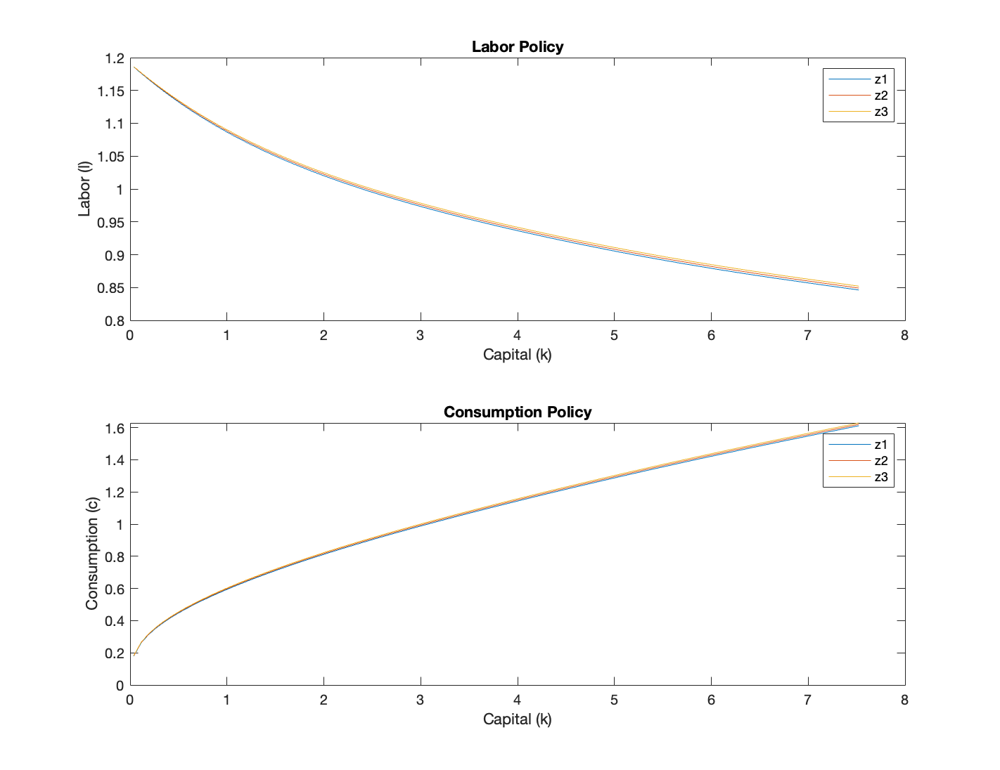
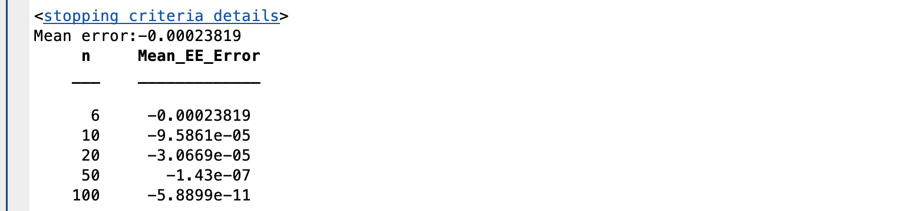

# Homework II, ECON 8210, Fall 2024
Author: Jiacheng Li  
Created: Dec. 21
Updated: Dec. 23

All the codes for this homework and this write-up document are in my Github repository with link: https://github.com/realjiachengli/ECON_8210_repository.

## The Problem
A representative household solves 
$$
\begin{align*}
    \max\;&\mathbb{E}_{0}\sum_{t=0}^{\infty}0.97^{t}\left(\log c_{t}-\frac{l_{t}^{2}}{2}\right)\\\text{s.t. }&c_{t}+k_{t+1}=e^{z_{t}}k_{t}^{0.33}l_{t}^{0.67}+0.9k_{t}
\end{align*}
$$ where $$z_{t}=0.95z_{t-1}+0.007\varepsilon_{t}$$

The problem can be recasted recursively in a Bellman equation: 
$$V(k,z)=\max_{c,l}\;\log\left(c\right)-\frac{l^{2}}{2}+\beta\mathbb{E}_{z'\vert z}\left[V(e^{z}k^{0.33}l^{0.67}+0.9k-c,z')\right]$$
where we can discretize the AR(1) process using Tauchen or Rouwenhorst. 

## 1. Chebyshev
To solve the problem using projection method with Chebyshev polynomial, we first derive the first-order conditions that policy functions need to satisfy: 
$$
\begin{align*}
    \frac{1}{c(k,z)}&=\beta\mathbb{E}_{z'\vert z}\left[\frac{1}{c(k',z')}(0.33e^{z'}k'^{-0.67}l'^{0.67}+0.9)\right]\\l(k,z)&=\frac{1}{c(k,z)}0.67e^{z}k^{0.33}l(k,z)^{-0.33}
\end{align*}
$$
The intratemporal condition gives: 
$$l(k,z)=\left(\frac{1}{c(k,z)}0.67e^{z}k^{0.33}\right)^{\frac{1}{1.33}}$$
Moreover, $$k'(k,z)=e^{z}k^{0.33}l(k,z)^{0.67}+0.9k-c(k,z)$$
Therefore, given a function $c(k,z)$, we can construct $l(k,z)$, and apply the Chebyshev collocation method on the Euler equation.

Since we have a fixed discrete grid for $z$ with $N_z = 5$, each policy function $c(k,\hat{z})$ can be approximated using a one-dimensional Chebyshev polynomial. 

First, we construct the steady state and use it as the initial guess: 
$$
\begin{align*}
l&=\left(\frac{1}{k^{0.33}l^{0.67}-0.1k}0.67k^{0.33}\right)^{\frac{1}{1.33}}\\1&=0.97(0.33k^{-0.67}l^{0.67}+0.9)
\end{align*}
$$
This gives $l = 0.9465, k=3.7612, c=1.1161$.

Here, I plot the solved policy functions:  

The mean Euler equation error is calculated based on a much finer grid for capital: the computed Chebyshev coefficients under collocation method are used to evaluate the approximated labor policy over the finer capital grid, then the labor policy are computed. And the normalized Euler equation error 
$$err=\beta\mathbb{E}_{z'\vert z}\left[\frac{c(k,z)}{c(k',z')}(0.33e^{z'}k'^{-0.67}l'^{0.67}+0.9)\right]-1$$
is averaged across all exogenous states over the entire capital grid.
In the table below, I show how the mean Euler equation error decreases with the number of basis functions (up to $n$-th order Chebyshev polynomials) we use:   

## 2. Perturbation
We use the third-order perturbation with pruning solved using Dynare to solve this problem.

## 3. Deep Learning

## 4. Comparison

