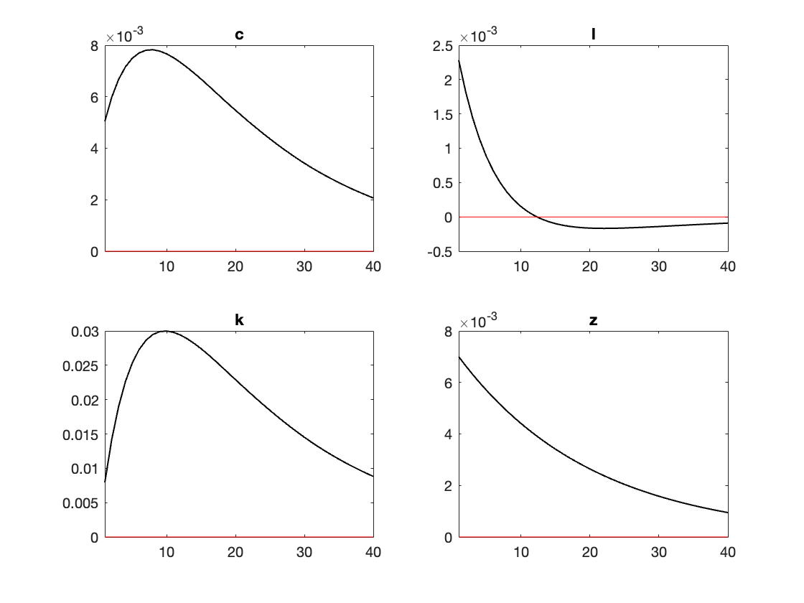
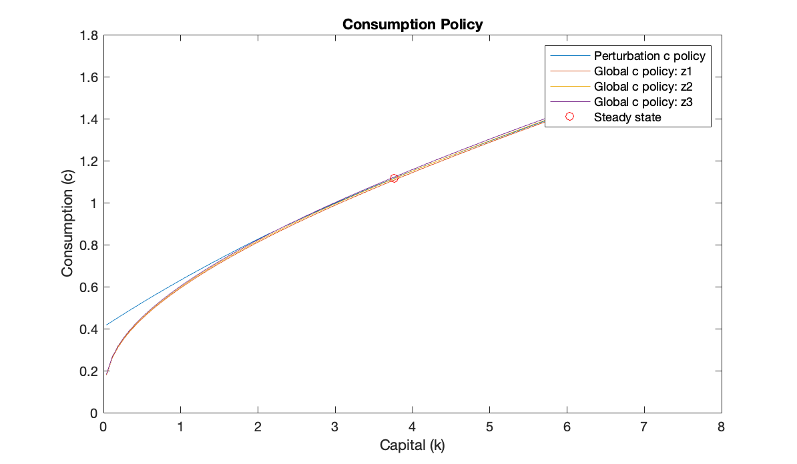
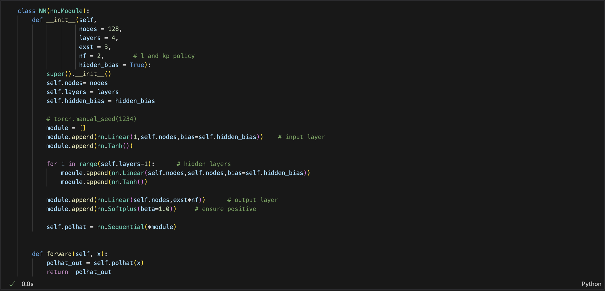
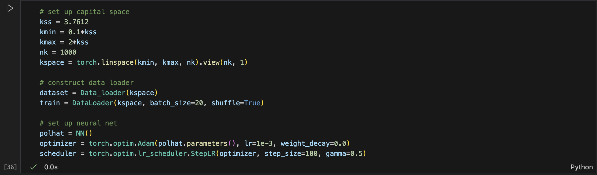
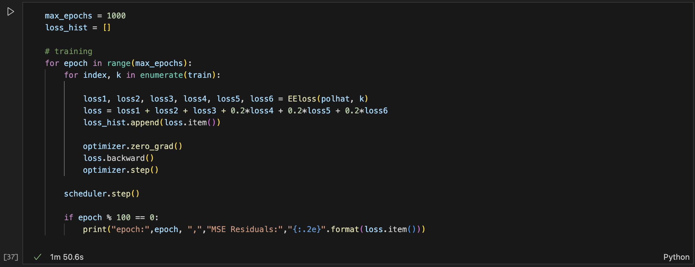
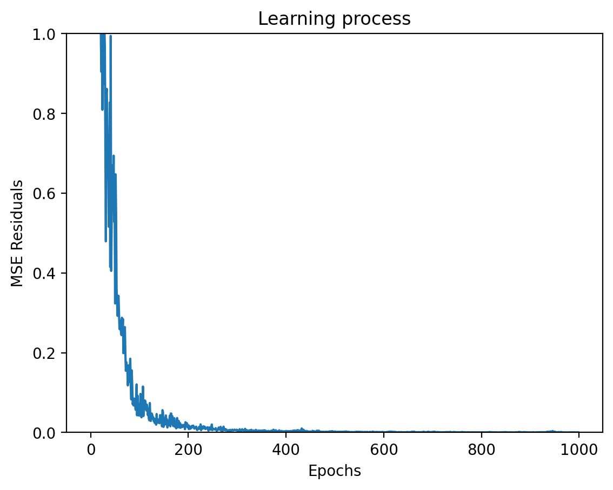
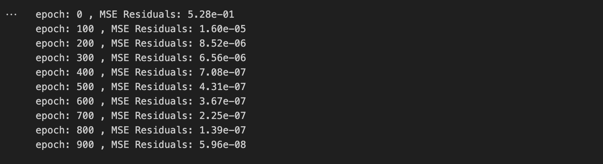
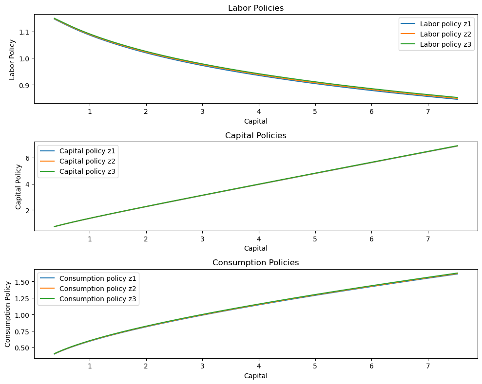

# Homework II, ECON 8210, Fall 2024
Author: Jiacheng Li  
Created: Dec. 21
Updated: Dec. 23


All the codes for this homework and this write-up document are in my Github repository with link: https://github.com/realjiachengli/ECON_8210_repository.


## The Problem
A representative household solves 
$$
\begin{align*}
    \max\;&\mathbb{E}_{0}\sum_{t=0}^{\infty}0.97^{t}\left(\log c_{t}-\frac{l_{t}^{2}}{2}\right)\\\text{s.t. }&c_{t}+k_{t+1}=e^{z_{t}}k_{t}^{0.33}l_{t}^{0.67}+0.9k_{t}
\end{align*}
$$ where $$z_{t}=0.95z_{t-1}+0.007\varepsilon_{t}$$

The problem can be recasted recursively in a Bellman equation: 
$$V(k,z)=\max_{c,l}\;\log\left(c\right)-\frac{l^{2}}{2}+\beta\mathbb{E}_{z'\vert z}\left[V(e^{z}k^{0.33}l^{0.67}+0.9k-c,z')\right]$$
where we can discretize the AR(1) process using Tauchen or Rouwenhorst. 


## 1. Chebyshev
To solve the problem using projection method with Chebyshev polynomial, we first derive the first-order conditions that policy functions need to satisfy: 
$$
\begin{align*}
    \frac{1}{c(k,z)}&=0.97\mathbb{E}_{z'\vert z}\left[\frac{1}{c(k',z')}(0.33e^{z'}k'^{-0.67}l'^{0.67}+0.9)\right]\\l(k,z)&=\frac{1}{c(k,z)}0.67e^{z}k^{0.33}l(k,z)^{-0.33}
\end{align*}
$$
The intratemporal condition gives: 
$$c(k,z)=\frac{1}{l(k,z)^{1.33}}0.67e^{z}k^{0.33}$$
Moreover, $$k'(k,z)=e^{z}k^{0.33}l(k,z)^{0.67}+0.9k-c(k,z)$$
Therefore, given a function $l(k,z)$, we can construct $c(k,z)$, and apply the Chebyshev collocation method on the Euler equation. For this exercise, I use the Miranda-Fackler's `compecon` toolbox to approximate the function using Chebyshev polynomials. The nodes are simply chosen using the zeros to the up to $n+1$-th order Chebyshev polynomials to have an $n$ by $n$ system. 

Since we have a fixed discrete grid for $z$ with $N_z = 5$, each policy function $l(k,\hat{z})$ can be approximated using a one-dimensional Chebyshev polynomial. 

First, we construct the steady state and use it as the initial guess: 
$$
\begin{align*}
l&=\left(\frac{1}{k^{0.33}l^{0.67}-0.1k}0.67k^{0.33}\right)^{\frac{1}{1.33}}\\1&=0.97(0.33k^{-0.67}l^{0.67}+0.9)
\end{align*}
$$
This gives $l = 0.9465, k=3.7612, c=1.1161$.

Here, I plot the solved policy functions:  

The mean Euler equation error is calculated based on a much finer grid for capital: the computed Chebyshev coefficients under collocation method are used to evaluate the approximated labor policy over the finer capital grid, then the labor policy are computed. And the normalized Euler equation error 
$$err=\beta\mathbb{E}_{z'\vert z}\left[\frac{c(k,z)}{c(k',z')}(0.33e^{z'}k'^{-0.67}l'^{0.67}+0.9)\right]-1$$
is averaged across all exogenous states over the entire capital grid.
In the table below, I show how the mean Euler equation error decreases with the number of basis functions (up to $n$-th order Chebyshev polynomials) we use:   


## 2. Perturbation
We use the third-order perturbation with pruning solved using Dynare to solve this problem.

```
var c l k z;
varexo e;
model;
    z = .95*z(-1)+.007*e;
    # lam = 1/c;
    # lamplus = 1/c(+1);
    lam = .97*lamplus*(.33*exp(z(+1))*(k/l(+1))^(-.67) + .9);
    l = lam*.67*exp(z)*(k/l)^.33;
    k = exp(z)*k(-1)^.33*l^.67 + .9*k(-1) - c;
end;
initval;
    z = 0;
    k = 3.7612;
    l = 0.9465;
    c = 1.1161;
end;
shocks;
    var e = 1;
end;
steady;
stoch_simul(order=3, pruning);
```
Here is the solved impulse response function:


To compare this method with the global projection method, I plot the derived consumption policy function using the third-order perturbation method with the solved projection policy function:



## 3. Finite Element
To solve the problem using finite element method, we avoid applying a bounded transformation of the normal innovation (as in the slides) but directly work with the discretized Markov chain. 

We can define the approximation policy function as $I_{fe}(k;z,\theta)=\sum_{i}\theta_{i,z}\Psi_{i}(k;z)$ where $\theta$ are the parameters. The residual function is 
$$
\mathcal{R}(k;z,\theta)=0.97\sum_{z'\in\left\{ z_{1},z_{2},z_{3}\right\} }P(z'\vert z)\left[\frac{c(k;z)}{c(k'(k;z);z')}(0.33e^{z'}k'(k;z)^{-0.67}l(k'(k;z);z'){}^{0.67}+0.9)\right]-1$$
This suggests we want to solve 
$$\sum_{z\in\left\{ z_{1},z_{2},z_{3}\right\} }\int_{k}\Phi_{i}(k;z)\mathcal{R}(k;z,\theta)dk=0,\quad\forall i$$
under a Galerkin scheme.    
It seems that in the unidimensional case, the finite element method is simply a linear interpolation scheme weighted by some weight functions to evaluate the loss function.


## 4. Deep Learning
Next, we solve the problem using deep learning. To do this, we approximate the policy function $l_i(k) = l(k,z_i)$ using a neutral network with 3 layers and 25 nodes per layer on capital, for each $z_i\in \{z_1, z_2, z_3\}$, discretized over the exogenous state space. The input layer takes 1 input/feature (capital) and the output layer generates 6 outputs/labels, that is, the labor policy corresponding to each of the exogenous state $l(k,z)$, and the next period capital policy corresponding to each exogenous state $k'(k,z)$. The reason I approximate them both, rather than simply computing the implied capital policy based on labor policy is that we want to **impose a non-negativity constraint** on both $l,k'$. This can be done in the definition of a neural network: 
```module.append(nn.Softplus(beta=1.0))     # ensure positive```

The loss function can be defined as:
$$\mathcal{L}(k;z)=0.97\sum_{z'}P(z'\vert z)\left[\frac{c(k;z)}{c(k'(k;z);z')}(0.33e^{z'}k'(k;z)^{-0.67}l(k'(k;z);z'){}^{0.67}+0.9)\right]-1$$

For this exercise, I use `PyTorch` to train the neural network and solve the model.

Here I define the neural network, with 4 layers with 128 nodes in each layer with the "Tanh" function.    


The Euler residuals are defined in a similar way as used for projection method. However, we in addition include the residual for the capital policy function as 
```
# capital policy
kp1rhs = torch.exp(z[0]) * k**0.33 * l1**0.67 + 0.9*k - c1     # want to enforce non-negativity constraint here
kp2rhs = torch.exp(z[1]) * k**0.33 * l2**0.67 + 0.9*k - c2
kp3rhs = torch.exp(z[2]) * k**0.33 * l3**0.67 + 0.9*k - c3
```
The loss function is defined as the weighted sum of squares over the Euler residuals and the capital policy residuals. 

The capital space is looped over, with the gridpoints picked around the steady state. Adam optimizer (stochastic gradient descent) is used to train the model. 1000 epoches are run with a batch size of 20 (i.e., 20 capital gridpoints in each batch).   



Here is how the learning process looks like:    


where I show the 


Below, I plot the labor, capital, and consumption policy functions in each state against the capital stock:   


As one can see, the policy functions look identical to the solution we obtained using Chebyshev collocation methods. 

## 5. Comparison

As we have seen, the global solution methods (e.g. projection method with Chebyshev collocation, finite element method, deep learning) can solve the problem very accurately globally given a large number of colloation nodes/order of Chebyshev polynomials, or a sophisticated neural net.

The perturbation solution approximates the global policy functions really well around the steady state but it cannot capture the nonlinearity farther away from the steady state, as I have demonstrated in previous figures.

In terms of speed, for this simply problem, the 3-order perturbation method (with pruning) is solved lightening fast. The projection method with Chebyshev polynomial is also solved very fast (6-th order in our example), as it simply involves solving a non-linear system of equations. The deep learning algorithm takes a "non-monotonic" convergence process as the neural net learns, but one can still see that the MSE residual drops quickly to 1e-7 level within the first several hundred epochs, which takes 5 seconds or so. 


## Code Appendix


### Projection and Pertubation (Matlab)

```
%%%%%%%%%%%%%%%%%%%%%%%%%%%%%%%%%%%%%%%%%%%%%%%%%%%%%%%
% 0. Housekeeping
%%%%%%%%%%%%%%%%%%%%%%%%%%%%%%%%%%%%%%%%%%%%%%%%%%%%%%%
clear all; close all; clc;

% add the Miranda-Fackler toolbox
addpath('../compecon/CEtools');

% add the Elenev et al. toolbox
addpath('../');

% add dynare
addpath('/Applications/Dynare/6.2-arm64/matlab');


%%%%%%%%%%%%%%%%%%%%%%%%%%%%%%%%%%%%%%%%%%%%%%%%%%%%%%%
% 1. Parameters
%%%%%%%%%%%%%%%%%%%%%%%%%%%%%%%%%%%%%%%%%%%%%%%%%%%%%%%
rrho = .95;
ssigma = .007;

% Rouwenhorst method
nz = 3;
mu_uncond = -.5 * ssigma^2/(1-rrho^2);
[transmat, zgrid] = Helpers.rouwen(rrho, mu_uncond, ssigma, 0, nz);
transmat = transmat';


%%%%%%%%%%%%%%%%%%%%%%%%%%%%%%%%%%%%%%%%%%%%%%%%%%%%%%%
% 2. Steady state
%%%%%%%%%%%%%%%%%%%%%%%%%%%%%%%%%%%%%%%%%%%%%%%%%%%%%%%
x0 = [1, 0.1]';

xsol = fsolve(@ssres, x0);
[~, css] = ssres(xsol);
kss = xsol(1);
lss = xsol(2);


%%%%%%%%%%%%%%%%%%%%%%%%%%%%%%%%%%%%%%%%%%%%%%%%%%%%%%%
% 3. Projection with Chebyshev
%%%%%%%%%%%%%%%%%%%%%%%%%%%%%%%%%%%%%%%%%%%%%%%%%%%%%%%

% define grids
nk = 6;
kmin = 0.01*kss;
kmax = 2*kss;

knodes = chebnode(nk,kmin,kmax);
fspace = fundef({'spline',nk,kmin,kmax});
T = chebbas(nk,kmin,kmax,knodes,0);

% initial guess
coefs0 = funfitxy(fspace,knodes,lss*ones(nk,1));
coefs0 = repmat(coefs0,1,nz);
coefs0 = reshape(coefs0,nk*nz,1);

f2solve = @(xx) projres(xx, T, fspace, knodes, zgrid, transmat);
opts = optimoptions('fsolve','Display','iter');
coefsopt = fsolve(f2solve, coefs0, opts);

coefsopt = reshape(coefsopt,nk,nz);


% unpack the solved policy function l(k,z)
coefz1 = coefsopt(:,1);
coefz2 = coefsopt(:,2);
coefz3 = coefsopt(:,3);


% plot
kfinegrid = linspace(kmin,kmax,100)';
lz1 = funeval(coefz1,fspace,kfinegrid);
lz2 = funeval(coefz2,fspace,kfinegrid);
lz3 = funeval(coefz3,fspace,kfinegrid);

% get consumption policy
cz1 = 1./(lz1.^1.33) *.67*exp(zgrid(1)).*kfinegrid.^.33;
cz2 = 1./(lz2.^1.33) *.67*exp(zgrid(2)).*kfinegrid.^.33;
cz3 = 1./(lz3.^1.33) *.67*exp(zgrid(3)).*kfinegrid.^.33;


% report mean EE error
error = EE_err(kfinegrid,coefsopt,zgrid,transmat,fspace);
disp(['Mean error:', num2str(mean(error))]);


% plot labor policy
figure;
subplot(2,1,1);
plot(kfinegrid, lz1, 'DisplayName', 'z1');
hold on;
plot(kfinegrid, lz2, 'DisplayName', 'z2');
plot(kfinegrid, lz3, 'DisplayName', 'z3');
title('Labor Policy');
xlabel('Capital (k)');
ylabel('Labor (l)');
legend;
hold off;

% plot consumption policy
subplot(2,1,2);
plot(kfinegrid, cz1, 'DisplayName', 'z1');
hold on;
plot(kfinegrid, cz2, 'DisplayName', 'z2');
plot(kfinegrid, cz3, 'DisplayName', 'z3');
title('Consumption Policy');
xlabel('Capital (k)');
ylabel('Consumption (c)');
legend;
hold off;


% show euler equation error for different number of Chebyshev polynomials
n_values = [6, 10, 20, 50, 100];
mean_errors = zeros(length(n_values), 1);

opts = optimoptions('fsolve','Display','off');

for i = 1:length(n_values)
    nk = n_values(i);
    knodes = chebnode(nk, kmin, kmax);
    fspace = fundef({'cheb', nk, kmin, kmax});
    T = chebbas(nk, kmin, kmax, knodes, 0);

    coefs0 = funfitxy(fspace, knodes, lss * ones(nk, 1));
    coefs0 = repmat(coefs0, 1, nz);
    coefs0 = reshape(coefs0, nk * nz, 1);

    f2solve = @(xx) projres(xx, T, fspace, knodes, zgrid, transmat);
    coefsopt = fsolve(f2solve, coefs0, opts);

    coefsopt = reshape(coefsopt, nk, nz);
    error = EE_err(kfinegrid, coefsopt, zgrid, transmat, fspace);
    mean_errors(i) = mean(error);
end

% create and print table
table_data = table(n_values', mean_errors, 'VariableNames', {'n', 'Mean_EE_Error'});
disp(table_data);


%%%%%%%%%%%%%%%%%%%%%%%%%%%%%%%%%%%%%%%%%%%%%%%%%%%%%%%
% 4. Perturbation
%%%%%%%%%%%%%%%%%%%%%%%%%%%%%%%%%%%%%%%%%%%%%%%%%%%%%%%
dynare perturb_dynare.mod

% plot the perturbed consumption policy against that solved by the global
% method

figure;
plot_policy_fun('k',kfinegrid','c');
hold on;
plot(kfinegrid, cz1, 'DisplayName', 'Global c policy: z1');
plot(kfinegrid, cz2, 'DisplayName', 'Global c policy: z2');
plot(kfinegrid, cz3, 'DisplayName', 'Global c policy: z3');

scatter(kss, css, 'ro', 'MarkerFaceColor', 'none', 'DisplayName', 'Steady state');
title('Consumption Policy');
xlabel('Capital (k)');
ylabel('Consumption (c)');
legend;
hold off;


```


### Deep learning (Python)
```
import numpy as np
import matplotlib.pyplot as plt
import torch
import torch.nn as nn
from torch.utils.data import Dataset, DataLoader

class NN(nn.Module):
    def __init__(self, 
                 nodes = 128,
                 layers = 4,
                 exst = 3,
                 nf = 2,        # l and kp policy
                 hidden_bias = True):
        super().__init__()
        self.nodes= nodes
        self.layers = layers
        self.hidden_bias = hidden_bias
        
        # torch.manual_seed(1234)
        module = []
        module.append(nn.Linear(1,self.nodes,bias=self.hidden_bias))    # input layer
        module.append(nn.Tanh())
        
        for i in range(self.layers-1):      # hidden layers
            module.append(nn.Linear(self.nodes,self.nodes,bias=self.hidden_bias))
            module.append(nn.Tanh())  
            
        module.append(nn.Linear(self.nodes,exst*nf))      # output layer
        module.append(nn.Softplus(beta=1.0))     # ensure positive
        
        self.polhat = nn.Sequential(*module)


    def forward(self, x):
        polhat_out = self.polhat(x)
        return  polhat_out


class Data_loader(Dataset):
    
    def __init__(self,kspace):
        self.kspace = kspace
        self.len = self.kspace.shape[0]

    def __getitem__(self,index):
            return self.kspace[index]
        
    def __len__(self):
        return self.len


def EEloss(polhat, k):
    
    # labor policy
    l1 = polhat(k)[:,[0]]
    l2 = polhat(k)[:,[1]]
    l3 = polhat(k)[:,[2]]
    
    # kp policy
    kp1 = polhat(k)[:,[3]]
    kp2 = polhat(k)[:,[4]]
    kp3 = polhat(k)[:,[5]]
    
    # discretized exogenous states
    z = torch.tensor([-0.0102, -0.0003, 0.0096])
    transmat = torch.tensor([[0.9506, 0.0488, 0.0006],
                             [0.0244, 0.9512, 0.0244],
                             [0.0006, 0.0488, 0.9506]])

    # consumption policy
    c1 = 1 / (l1**1.33) * 0.67 * torch.exp(z[0]) * k**0.33
    c2 = 1 / (l2**1.33) * 0.67 * torch.exp(z[1]) * k**0.33
    c3 = 1 / (l3**1.33) * 0.67 * torch.exp(z[2]) * k**0.33
    
    # capital policy
    kp1rhs = torch.exp(z[0]) * k**0.33 * l1**0.67 + 0.9*k - c1     # want to enforce non-negativity constraint here
    kp2rhs = torch.exp(z[1]) * k**0.33 * l2**0.67 + 0.9*k - c2
    kp3rhs = torch.exp(z[2]) * k**0.33 * l3**0.67 + 0.9*k - c3
    
    # next period kp and labor policy
    polp1 = polhat(kp1)
    polp2 = polhat(kp2)
    polp3 = polhat(kp3)
    
    lp1 = polp1[:,[0]]
    lp2 = polp2[:,[1]]
    lp3 = polp3[:,[2]]
    
    cp1 = 1 / (lp1**1.33) * 0.67 * torch.exp(z) * kp1**0.33
    cp2 = 1 / (lp2**1.33) * 0.67 * torch.exp(z) * kp2**0.33
    cp3 = 1 / (lp3**1.33) * 0.67 * torch.exp(z) * kp3**0.33
    
    # Euler equation
    res1 = torch.mm(0.97 * c1/cp1 * (0.33*torch.exp(z) * kp1**(-0.67) * lp1**0.67 + 0.9), transmat[[0],:].T) - 1
    res2 = torch.mm(0.97 * c2/cp2 * (0.33*torch.exp(z) * kp2**(-0.67) * lp2**0.67 + 0.9), transmat[[1],:].T) - 1
    res3 = torch.mm(0.97 * c3/cp3 * (0.33*torch.exp(z) * kp3**(-0.67) * lp3**0.67 + 0.9), transmat[[2],:].T) - 1
    res4 = kp1 - kp1rhs
    res5 = kp2 - kp2rhs
    res6 = kp3 - kp3rhs
    
    loss1 = res1.pow(2).mean()
    loss2 = res2.pow(2).mean()
    loss3 = res3.pow(2).mean()
    loss4 = res4.pow(2).mean()
    loss5 = res5.pow(2).mean()
    loss6 = res6.pow(2).mean()
    
    return loss1, loss2, loss3, loss4, loss5, loss6
    

# set up capital space
kss = 3.7612
kmin = 0.1*kss
kmax = 2*kss
nk = 1000
kspace = torch.linspace(kmin, kmax, nk).view(nk, 1)

# construct data loader
dataset = Data_loader(kspace)
train = DataLoader(kspace, batch_size=20, shuffle=True)

# set up neural net
polhat = NN()
optimizer = torch.optim.Adam(polhat.parameters(), lr=1e-3, weight_decay=0.0)
scheduler = torch.optim.lr_scheduler.StepLR(optimizer, step_size=100, gamma=0.5)


max_epochs = 3000
loss_hist = []

# training
for epoch in range(max_epochs):
    for index, k in enumerate(train):
        
        loss1, loss2, loss3, loss4, loss5, loss6 = EEloss(polhat, k)
        loss = loss1 + loss2 + loss3 + 0.2*loss4 + 0.2*loss5 + 0.2*loss6
        loss_hist.append(loss.item())
        
        optimizer.zero_grad()
        loss.backward()
        optimizer.step()
        
    scheduler.step()
    
    if epoch % 100 == 0:
        print("epoch:",epoch, ",","MSE Residuals:","{:.2e}".format(loss.item())) 
    
plt.figure(dpi=200)
plt.plot(np.array(loss_hist[1:1000]))
plt.ylim([0,1])
plt.title('Learning process')
plt.xlabel('Epochs')
plt.ylabel('MSE Residuals')


polmat = polhat(kspace).detach()

fig, axs = plt.subplots(3, 1, figsize=(10, 8))

# Plot labor policies
axs[0].plot(kspace, polmat[:, [0]], label='Labor policy z1')
axs[0].plot(kspace, polmat[:, [1]], label='Labor policy z2')
axs[0].plot(kspace, polmat[:, [2]], label='Labor policy z3')
axs[0].legend()
axs[0].set_xlabel('Capital')
axs[0].set_ylabel('Labor Policy')
axs[0].set_title('Labor Policies')

# Plot capital policies
axs[1].plot(kspace, polmat[:, [3]], label='Capital policy z1')
axs[1].plot(kspace, polmat[:, [4]], label='Capital policy z2')
axs[1].plot(kspace, polmat[:, [5]], label='Capital policy z3')
axs[1].legend()
axs[1].set_xlabel('Capital')
axs[1].set_ylabel('Capital Policy')
axs[1].set_title('Capital Policies')

# Compute consumption policies
l1 = polmat[:, [0]]
l2 = polmat[:, [1]]
l3 = polmat[:, [2]]
z = torch.tensor([-0.0102, -0.0003, 0.0096])

c1 = 1 / (l1**1.33) * 0.67 * torch.exp(z[0]) * kspace**0.33
c2 = 1 / (l2**1.33) * 0.67 * torch.exp(z[1]) * kspace**0.33
c3 = 1 / (l3**1.33) * 0.67 * torch.exp(z[2]) * kspace**0.33

# Plot consumption policies
axs[2].plot(kspace, c1, label='Consumption policy z1')
axs[2].plot(kspace, c2, label='Consumption policy z2')
axs[2].plot(kspace, c3, label='Consumption policy z3')
axs[2].legend()
axs[2].set_xlabel('Capital')
axs[2].set_ylabel('Consumption Policy')
axs[2].set_title('Consumption Policies')


plt.tight_layout()
plt.show()
```